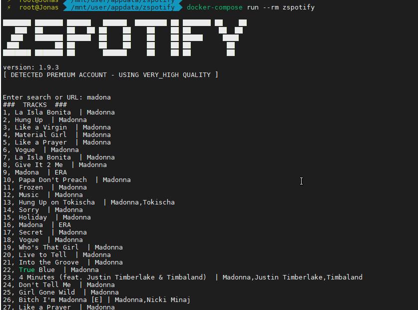
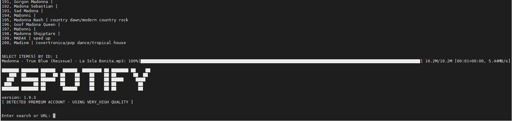

# zspotify

[](https://github.com/jsavargas/zspotify)
[](https://hub.docker.com/r/jsavargas/zspotify)
[](https://hub.docker.com/r/jsavargas/zspotify/)
[](https://hub.docker.com/r/jsavargas/zspotify/)
[](https://hub.docker.com/r/jsavargas/zspotify/)


## Find us at:

* [GitHub](https://github.com/jsavargas/zspotify) - GitHub of this repository.
* [DockerHub](https://hub.docker.com/r/jsavargas/zspotify) - DockerHub of this repository.

Fork of https://github.com/Footsiefat/zspotify

Spotify song downloader without injecting into the windows client





## Docker:

```
  docker run --rm -it -v $(pwd)/docker/config:/root/.config/ZSpotify -v $(pwd)/docker/download:/root/Music jsavargas/zspotify
  
  docker-compose run --rm zspotify
```


## Requirements:

```
Binaries
    - Python 3.9 or greater
    - ffmpeg*

Python packages:
    - pip install -r requirements.txt
```

\*ffmpeg can be installed via apt for Debian-based distros or by downloading the binaries from [ffmpeg.org](https://ffmpeg.org) and placing them in your %PATH% in Windows.


```
Command line usage:
  python zspotify.py                              Loads search prompt to find then download a specific track, album or playlist

Extra command line options:
  -p, --playlist          Downloads a saved playlist from your account
  -ps, --playlist-sort    Download a saved playlist from your account sorted by name
  -ls, --liked-songs      Downloads all the liked songs from your account
  -pid, --playlist-id [id] [folder_name]  Downloads a playlist from their id and saves in folder_name. This playlist can be created by other user, not only your playlists. 

Special hardcoded options:
  ROOT_PATH           Change this path if you don't like the default directory where ZSpotify saves the music

  SKIP_EXISTING_FILES Set this to False if you want ZSpotify to overwrite files with the same name rather than skipping the song

  MUSIC_FORMAT        Set this to "ogg" if you would rather that format audio over "mp3"
  RAW_AUDIO_AS_IS     Set this to True to only stream the audio to a file and do no re-encoding or post processing
  
  FORCE_PREMIUM       Set this to True if ZSpotify isn't automatically detecting that you are using a premium account
  
```


## **Changelog:**

**v1.9.8 (01 Feb 2023)**
- Fix album without image / jlsalvador/fix-album-without-image
- Add egg name for librespot-python dependency (Fix) / scarlettekk/librespot-egg

**v1.9.7 (29 Dic 2022)**
- Sum the size of the images, compares and saves the index of the largest image size

**v1.9.4 (14 Oct 2022)**
- add cover 640x640

**v1.9.3 (30 Sep 2022)**
- add KeyboardInterrupt control - Control + C

**v1.9.2 (19 Aug 2022)**
- Added playlist_id support (https://github.com/VicDominguez)
- Fix -ls argument (https://github.com/axsddlr)
- Song Archive, to SKIP_PREVIOUSLY_DOWNLOADED (https://github.com/diebolo)

**v1.9.1 (19 Aug 2022)**
- Added extra option to download a playlist with the playlist-id. This playlist doesn't need be yours, it can be from other user.

**v1.9 (20 Jun 2022):**
- Fix fails at 87%

**v1.8 (23 Oct 2021):**
- exclude album_type single
- Added progress bar for downloads.
- Changed welcome banner and removed unnecessary debug print statements.
- Show single progress bar for entire album.
- Added a small delay between downloading each track when downloading in bulk to help with downloading issues and potential bans.

**v1.7 (21 Oct 2021):**
- Added docker support
- Added range download example 1-10 example: SELECT ITEM BY ID: 1-10
- Added download all albums by artist
- Added subfolders for each disc
- Naming tracks: "artist - album - track-number. name"
- Setting Limit in 50 items

**v1.6 (20 Oct 2021):**
- Added Pillow to requirements.txt.
- Removed websocket-client from requirements.txt because librespot-python added it to their dependency list.
- Made it hide your password when you type it in.
- Added manual override to force premium quality if zspotify cannot auto detect it.
- Added option to just download the raw audio with no re-encoding at all.
- Added Shebang line so it runs smoother on Linux.
- Made it download the entire track at once now so it is more efficent and fixed a bug users encountered.

